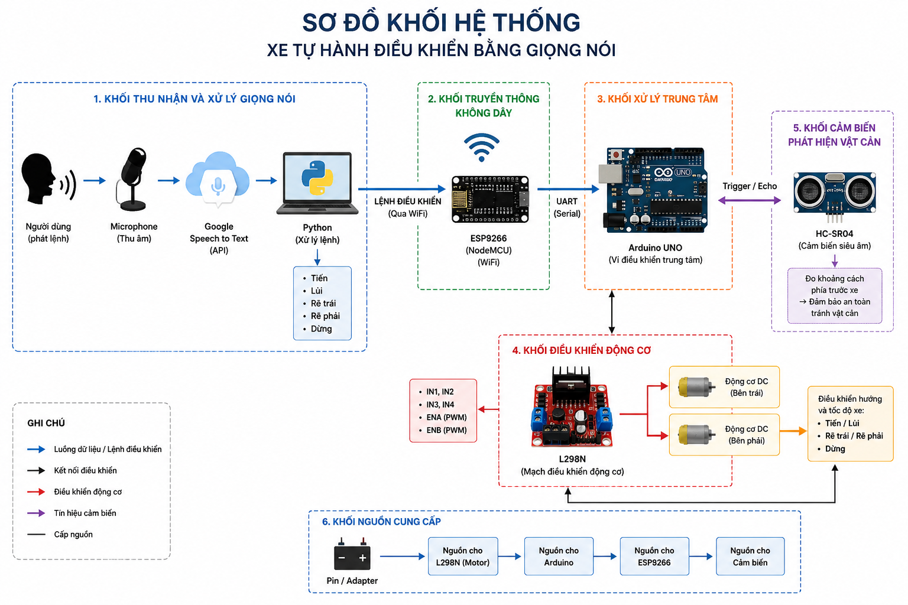
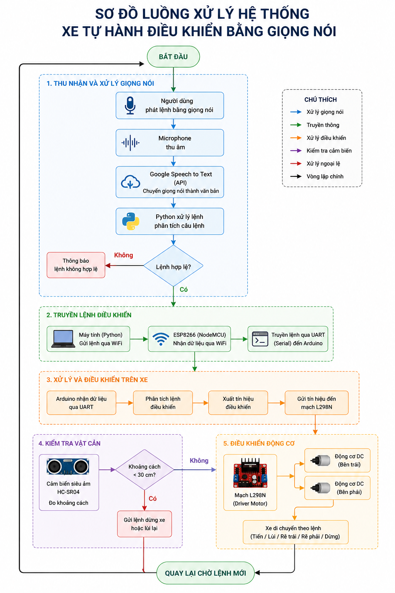
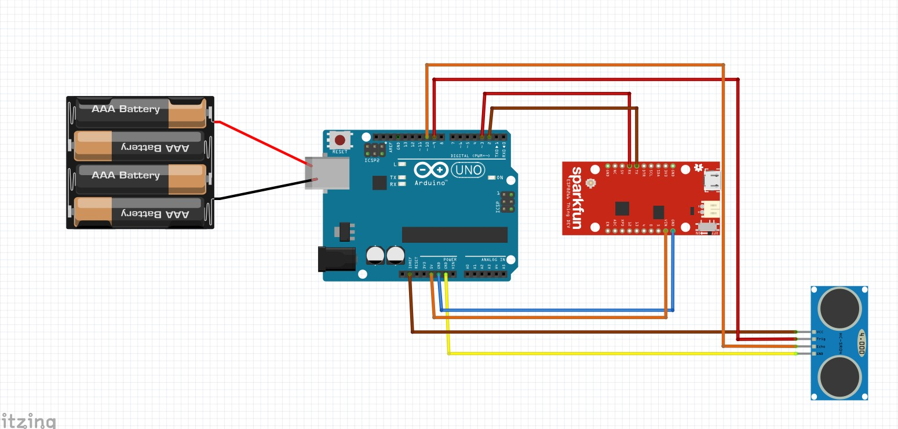
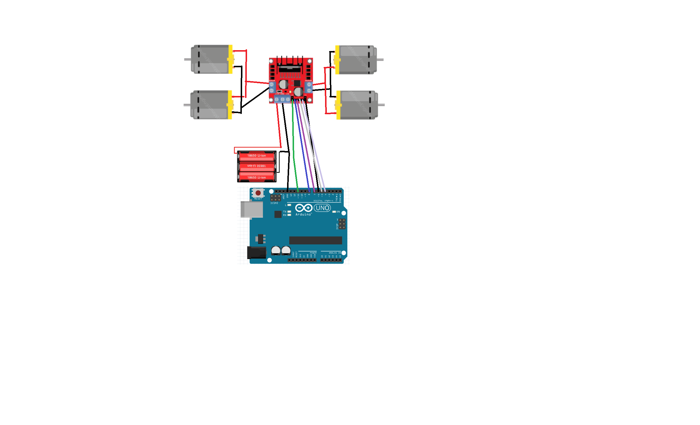

Hệ Thống Xe Tự Hành Điều Khiển Bằng Giọng Nói

## Giới thiệu

Đây là đồ án xây dựng hệ thống xe tự hành sử dụng công nghệ nhận diện giọng nói để điều khiển chuyển động từ xa thông qua mạng Wi-Fi. Hệ thống kết hợp giữa phần cứng nhúng Arduino, ESP8266, cảm biến siêu âm HC-SR04 và phần mềm Python nhằm tạo ra một mô hình xe thông minh có khả năng nhận lệnh bằng giọng nói và tự động tránh vật cản.

## Chức năng chính

- Điều khiển xe bằng giọng nói tiếng Việt.
- Kết nối không dây qua Wi-Fi sử dụng ESP8266.
- Điều khiển động cơ thông qua mạch cầu H L298N.
- Tự động phát hiện vật cản bằng cảm biến HC-SR04.
- Tự động dừng hoặc tránh vật cản khi khoảng cách không an toàn.
- Giám sát trạng thái hoạt động qua Serial Monitor.

## Công nghệ sử dụng

### Phần cứng

- Arduino Uno
- ESP8266 NodeMCU
- L298N Motor Driver
- HC-SR04 Ultrasonic Sensor
- Động cơ DC giảm tốc
- Khung xe 4 bánh
- Pin nguồn

### Phần mềm

- Arduino IDE
- Python 3.x
- Visual Studio Code

### Thư viện Python

- requests
- speech_recognition
- pyaudio

### Thư viện Arduino

- ESP8266WiFi
- ESP8266WebServer
- SoftwareSerial

## Nguyên lý hoạt động

1. Người dùng phát lệnh bằng giọng nói:
   - Tiến
   - Lùi
   - Trái
   - Phải
   - Dừng

2. Chương trình Python sử dụng Google Speech Recognition để chuyển giọng nói thành văn bản.

3. Lệnh điều khiển được gửi qua Wi-Fi đến ESP8266.

4. ESP8266 tiếp nhận lệnh và truyền xuống Arduino thông qua UART.

5. Arduino điều khiển mạch L298N để điều khiển động cơ.

6. Cảm biến HC-SR04 liên tục đo khoảng cách phía trước.

7. Khi phát hiện vật cản trong vùng nguy hiểm, hệ thống tự động dừng hoặc tránh vật cản.

## Sơ đồ hệ thống





### Sơ đồ phần cứng





## Cài đặt

### Clone dự án

```bash
git clone https://github.com/Nek0h1me/HeThongXeTuHanhBangGiongNoi.git
```

### Cài đặt thư viện Python

```bash
pip install requests
pip install SpeechRecognition
pip install pyaudio
```

### Nạp chương trình

- Upload code ESP8266 bằng Arduino IDE.
- Upload code Arduino Uno.
- Chỉnh địa chỉ IP ESP8266 trong file `main.py`.

Ví dụ:

```python
CAR_IP = "http://192.168.1.7"
```

## Lệnh điều khiển hỗ trợ

| Giọng nói | Chức năng |
|------------|-----------|
| Tiến | Xe chạy thẳng |
| Lùi | Xe lùi |
| Trái | Rẽ trái |
| Phải | Rẽ phải |
| Dừng | Dừng xe |
| Thoát | Kết thúc chương trình |

## Kết quả đạt được

- Điều khiển xe bằng giọng nói tiếng Việt thành công.
- Giao tiếp Wi-Fi ổn định.
- Nhận diện lệnh nhanh.
- Tự động phát hiện vật cản.
- Hệ thống hoạt động thời gian thực.


## Hướng phát triển

- Tích hợp Camera AI.
- Nhận diện vật thể bằng YOLO.
- Điều khiển bằng ứng dụng Android.
- Kết hợp GPS để định vị.
- Xây dựng mô hình xe tự hành hoàn toàn.

## Tác giả

Nguyễn Cao Tùng

## Giấy phép

Dự án được phát triển phục vụ mục đích học tập và nghiên cứu.
